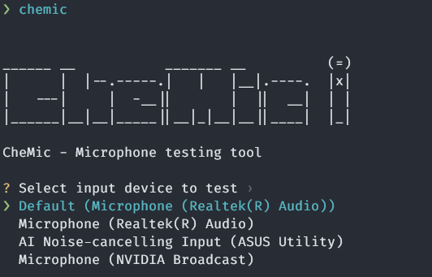
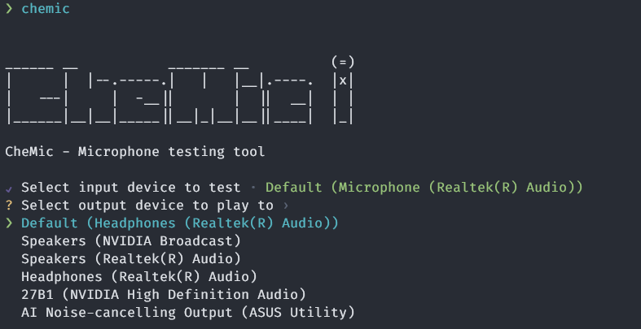

# 🎤 CheMic

> `Check-Microphone` Microphone checking tool

This is a tool for checking your microphone using the command line. 


## Installation

### Releases

You can download the latest release for Windows from [Here](https://github.com/jacobtread/chemic/releases/latest/download/chemic.exe)

### Cargo Install

If you have Cargo installed you can install it using the following command

```
cargo install chemic
```


## 📷 Screenshots




